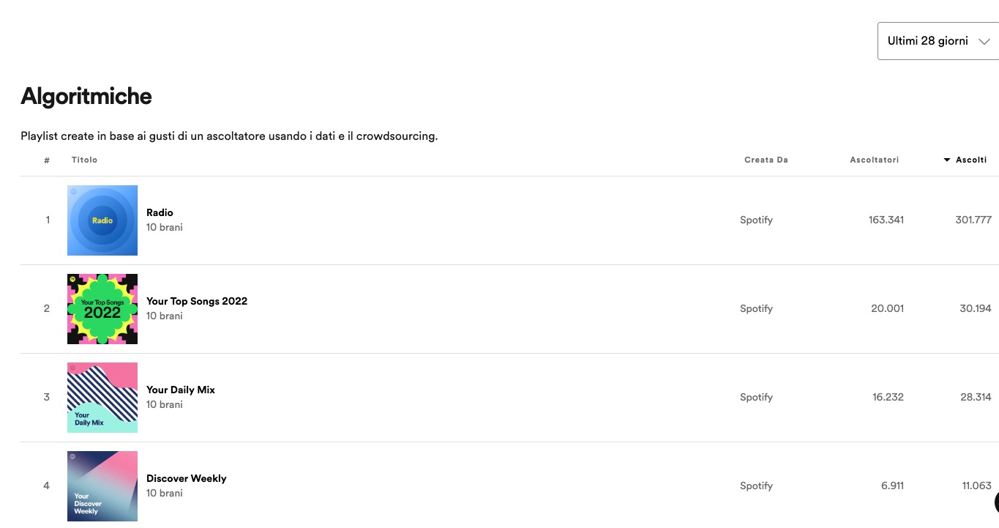
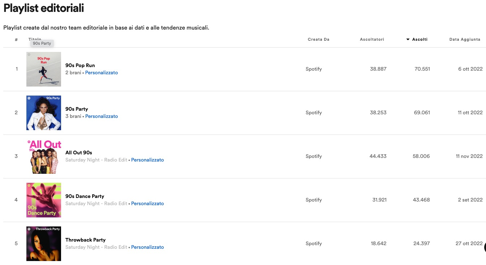
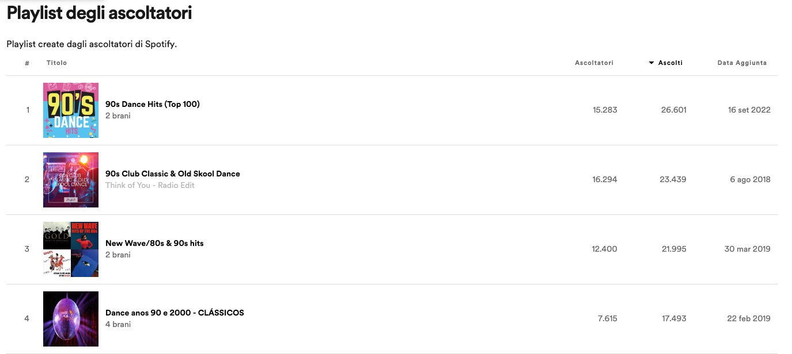
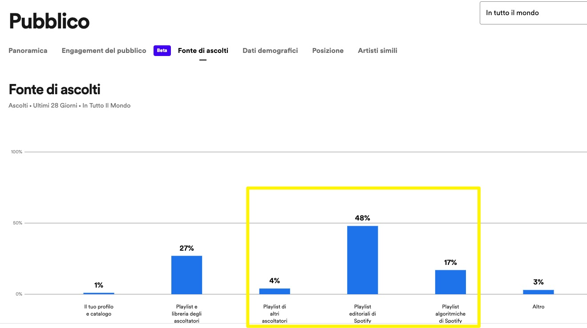
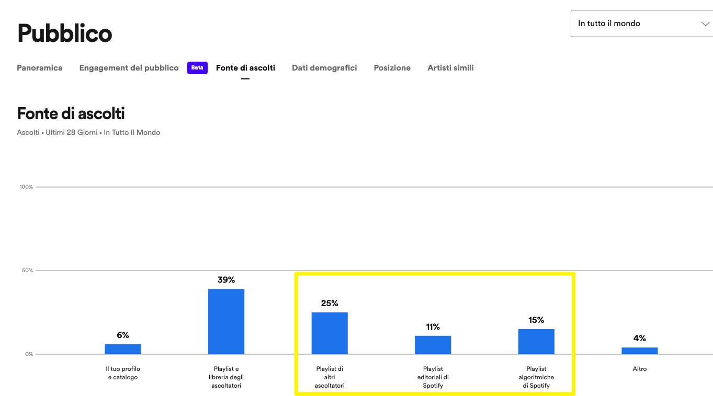
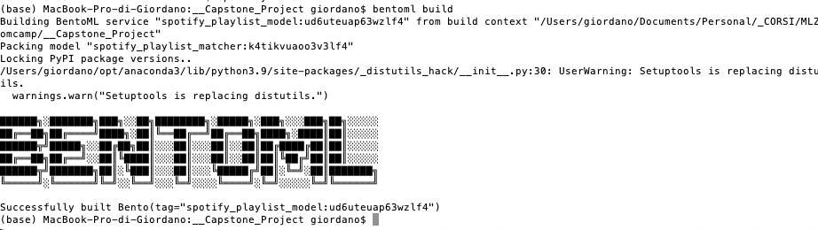
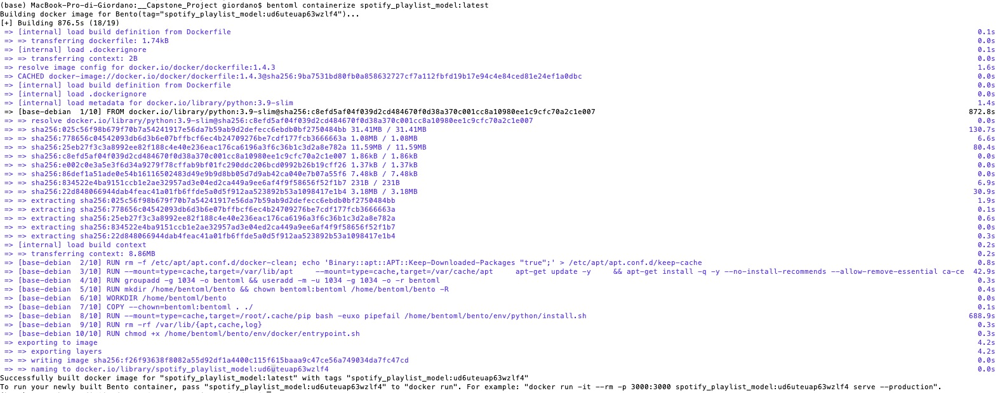
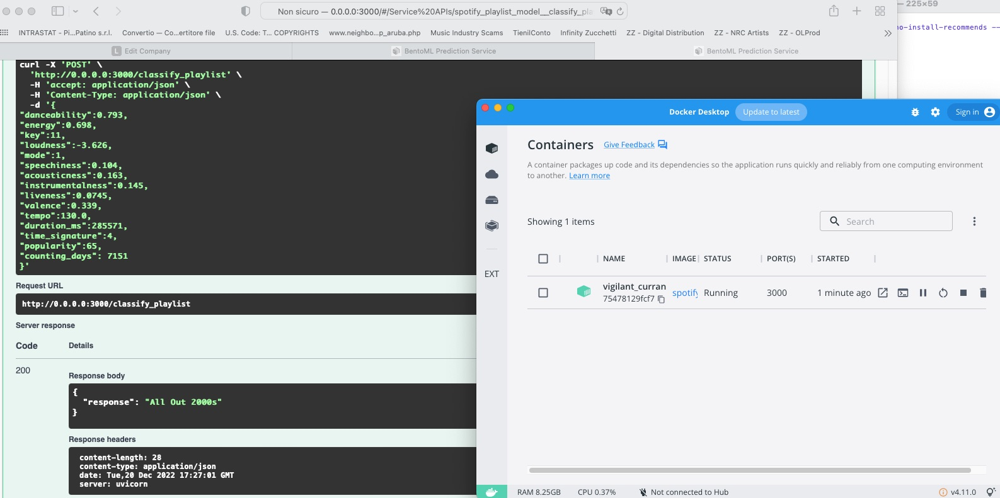

# Spotify Playlist Match

## Project Description
We aim to find if a song is suitable for a playlist in spotify, and -among a list of playlist - where does it fit best.

Spotify playlisting is a way for an artist to get exposure and have his/her repertoire listened to.
With over 100k new tracks uploaded daily on Spotify, being featured in a playlist is extremely helpful to emerge. 
There are mainly 3 types of playlist on Spotify (and in almost all the streaming platform):
- Algorithmic Playlist
- Editorial Playlist
- Users Playlist

Algo playlist create a list of tracks to be included in the playlist based on an algorithm created by Spotify. This analyzes the user's taste and listening history, in order to provide a tailor made playlist that best fits his/her tastes. These playlists are 'timed' (in a particular day, Spotify creates the playlist with the most recent releases that are good for your listening history).



Editorial playlist are the most sought after, as these are human-edited (by people working for Spotify) and are public playlist with large following.
These are well featured on the homepage(s) of the users and are not-user tailored. Kinda the new radio.
These are the objective of our study.




User's Playlist are made by users for themselves and/or other like-minded users that can find them searching keywords. The audience is quite limited (except for playlisting houses - now property of the majors [aka Filtrr, Digster, Topsify ]. These are potentially interesting fo our use case. 
The model we develop and its results could be used for this kind of playlists. When a playlist manager (outside of Spotify) has to decide which of its playlists best fit for the song to add, s/he could use the tool to help in the choice.




[the above images come from "Spotify for Artists", a tool that shows in which playlists the artist' repertoire is being streamed.]


## What we're trying to achieve. 
when you song is ingested into spotify, it gets algorithmically analyzed. Every track has its own "fingerprint": both on the classical stage, and one more in-depth analysis on the musical side.
All these analysis are available via Spotify API. 
We're going to download (thanks spotipy!) and analyze the content of the most followed playlists, and - given a track published on Spotify, the model will find which among these playlist is the best fit for the track. Then, this can be pitched to the editorial team of Spotify. 
The model can be fine tuned for the best fitting among the "same genre" playlist, for example (selecting a list of playlists more genre narrowed). 
This same tool could be used by companies that are in the playlisting business (providing exposure to tracks in their popular playlists), so that they can find their 'best match' among the playlist they manage. 
Being on the right playlist for an artist is important.
Here 2 examples of how an artist' plays are split among different kind of playlists:






## It's a multiclass-classification problem. 
- Input: a Spotify song details
- Output: a Spotify playlist name among the list of playlist analyzed.

Note that these playlist change regularly (weekly), so the model should be retrained frequently.
Or at least when some of the playlist gets changed (tracks in/tracks out).
Also, as we'll see, one feature (days from release date) is a changing feature, and the model should be retrained weekly.

The input is a json dictionary. The next step would be to get these details automatically from Spotify, compile the dictionary, and then send the request to the inference service. We're analyzing the inference service only.

General caveat (warning):
the Playlist we downloaded and analyzed are the most streamed in the western world. The representation of the music data collected is limited to the western music style. Note that BTS - a k-Pop act - also works in the "western" music. The non-western music has not been tracked. So musical consideration that will follow take into consideration the western world music system. No arabic-mode or other type of analysis.
So, modes are major/minor, keys are 12. (as the semitones)

## Data acquisition
[notebook: 00_Spotify_Data_download.ipynb]
Via Spotipy (a great library in python used to access the Spotify webapi), we access and download  the data of the songs included in the playlists.
The playlists we've included are listed in the playlist_name.json file.
The datafile.csv we get includes all the columns (and even more than the one we need).
In this file we included the artist and track name. These have been then removed from the Pandas dataframe we use when training the models. This feature could infere a correlation with popularity (due to marketing forces external to the song itself). So the training will be on song characteristics only.

The playlist we downloaded data from are the Top 50 most popular playlists on Spotify, according to https://www.chosic.com/best-spotify-playlists/ .
[link][playlistlink]
These are almost-editorial playlists. (Almost in the sense that some of them are generated using data from Spotify's backend) 
But these are not algorithmic playlist, meaning these are available to all users, not user-customized by Spotify.

The song included in each of them is a variable list, varying weekly or monthly or with a even lower frequency.
We collected the data regarding the audio details (not the full audio-analysis, which is another step in the details of each song), the popularity and the release date of the album containing the songs in the playlist.
The audio details are: 
danceability,energy,key,loudness,mode,speechiness,acousticness,instrumentalness,liveness,valence,tempo

The audio-analysis, would include a lot of musical-related (and deep analysis) of the single track.
This would include a time-analysis of song segmentation, a detailed 'line by line' analysis, including pitches and timbre involved in each single audio segment of the track. Also not a lot of details are provided regarding this kind of segmentation (which is made at time of ingesting by Spotify bots). 
Anyway, this deep analysis does not include Lyrics analysis. Nor lyrics are available at this stage trough Spotify WebAPI. This is probably due to a licensing hurdle.
If we had to conduct a sentiment analysis involving lyrics, we'd have to interact with MusixMatch API, who does have lyrics and timing (MusixMatch is licensed), and then link each track with the corresponding lyrics or feature we can extract from those data. 
 
So, this first analysis will involve 'only' the audio details of the track, and some feature engineering as to detect the period of release of a track, and its 'ever green' status, as some of the most followed playlists involve a "decade" mood ("All out 2000s", "All out 80s").

Note that "genre" is not included in the collected data. Spotify is "genre agnostic", at least at track level, and keeping up with the evolving scenario inside each niche is really hard (see for example Beatport - a niche digital music store/service provider centered around electronic music, which has to recalibrate genre every 2/3 years to accomodate new waves of music in a sub-genre of its niche). 

We'll try to find out if there is any correlation between the tracks in a single playlist.
And then, given a "non-playlisted" track, find which of the 50 analyzed playlist is the best match, according to the details of the track.

## EDA
[notebook 01_EDA.ipynb]
We did the analysis of the collected data.
Some musical considerations regarding the mode (major/minor) of the tracks collected. And their correlation with some kind of playlists.
Also the 'energy' and 'loudness' factor in connection with relaxing playlists.
We did some considerations regarding the popularity of a track (popularity in the sense of the data provided by the dataset) and presence in multiple playlists. And the question of including the duplicates anyway, as these contribute to the "mood" of a playlist.
What we'll try to achieve, will be a "mega mean" for each playlist, so that, given a track with unseen parameters, the system will find the best fitting playlist for that track.
Some more comments and explanation are found in the EDA notebook itself.


## Modeling, selection of the best model.
[notebook 02_Model Training.ipynb]
The problem is a multi class classification one.
With a target of 50 classes.
We trained and evaluated multi class versions of these classifiers:
Linear Logistic Regressor
Decision Tree
Random Forest
XGBoost

The notebook contains the training and fine tuning of the best model.
All the models work quite good with our dataset. 
For each of them the accuracy and AUC score (multi class with ovr criteria) is calculated.
In the end, I've chosen XGBoost as it's probably the best for tabular data and it's fully compatible with BentoML.
This time, we'll deploy it with a multi class classification problem.

## Train the definitive model.
[train.py]
I've taken out the script from the Notebook (manually), and adapted a little bit.
I've dumped the playlist name to a json file (that will be read at test time).
The playlist name in fact, is not in the training matrix.
For a multi class classification the label of the target class must be an integer in the range [0 - num_class-1]
This is achieved with the idx virtual column, with the ngroup function.

Train test split is done with stratify, in order to achieve a proportional target class distribution in the 2 sets (train and test). With a high number of classes, the risk could be that one class is completely left out of a test set (or is under represented in the train set).

We then train the XGBBoost classifier with DMatrix data type. 
The objective is multiprob, which outputs the song's probability for each class (playlist).
The class with the highest probability is the one best fitting for the song.
We save the model with BentoML and then we reload it in the test.py module.
[test.py]

You can play around with some of the song's data I've collected from Spotify.
These are taken out of the playlist set, so they are "new songs" to the model.
In the Data Extraction notebook there's the skeleton of how to get the single data from a song (query the API with the track ID).
In Sample songs.txt you can find the values to copy & paste in the test.py file, in order to receive the predicted "best matching" playlist, according to the songs characteristical data.


## Deployment - Local and in the Cloud
[predict.py]
[bento.yaml]

Via BentoML, I've built the model.
- 1 - create the predict.py file, which is the interface Bento will expose.
In this, via Bento, he recalls the latest saved model and loads the custom objects (DictVectorizer).
- 2 - define the pydantic interface to expose (the data we'll paste in the interface)
- 3 - define the service (what it gets, what it returns)
- 4 - write the bento.yaml [in the development directory] file, which contains the project structure and dependencies (xgboost, pydantic, numpy and scikit-learn)
I had to include sciiti-learn, as the DictVectorizer comes from that module.
- 5 - include all the files - including the playlist_name.json file. This is used at runtime in order to provide a human readable result.
- 6 - 
```bash
bentoml build
```
This finally builds the Bento.



You can then serve it with: 

```bash
bentoml serve predict.py:svc
```

And you can test it locally on http://0.0.0.0:3000

I've found 2 hurdles:
- A - the BentoML service is not scriptable - this makes sense, as it is thought for great volumes of batch processing
- B - we can not assign item value (which would have substituted the release_date with the counting_days variable in the input dict). 

This is due to the calculation of the days of distance from the current date and the original release date of the songs.
This was a feature we used in the EDA and the test/predict analysis.
A possible solution would be to calculate the counting days outside the BentoML scenario and customize the input we give to BentoML accordingly. 

If I setup the interface to recollect the datas from Spotify in realtime (i.e. input a song link and extract data to be sent to the inference engine), this would be calculated in that instance.
BentoML is thought for performance of the inference.

In this case, I calculated the counting_days for the sample songs.
In the sample_songs_for_BentoML.txt instead of 'release_date' the value inserted is counting_days, which is of type int.
As you can see, the pydantic declaration and the framework we are giving to BentoML has changed, but the model receives now a data dict (JSON) that is compatible with what has been trained.


>Local deployment.

With  
```bash
bentoml containerize spotify_playlist_model:latest
```




Bento builds the local docker version of the project.
You can then run it locally.
```bash
docker run -it --rm -p 3000:3000 spotify_playlist_model:ud6uteuap63wzlf4 serve --production
```
And test it.




>Deploy to the cloud.

I deployed via bentoctl, already used in the midterm project.
Via the interactive menu, bentoctl creates a terraform file (a yaml file detailing the needs of the project: memory, instances, cpu).
Then with 
```bash
bentoctl build -b spotify_playlist_model:latest -f deployment_config.yaml
```
(and having previously created a project in GCloud Run and enabled the API on the container registry)
it starts uploading to the container registry the Docker image file (built locally with BentoML).

Terraform will deploy the container in production.

```bash
terraform init

terraform apply -var-file=bentoctl.tfvars -auto-approve
```
The bentoctl.tfvars has been interactively created via CLI, and contains the details needed for the actual cloud deployment of the image pushed to the registry.
- Useful tip: never use _ (underscore) in the names of your project/deployment. 
Google CloudRun doesn't like it.

And...(drumroll)

https://spotify-playlist-matcher-cloud-run-service-2q3fby7qsq-od.a.run.app
[deploylink]

voilà!
App deployed to GoogleCloudRun!


[playlistlink]: <https://www.chosic.com/best-spotify-playlists/>
[deploylink]: <https://spotify-playlist-matcher-cloud-run-service-2q3fby7qsq-od.a.run.app>

